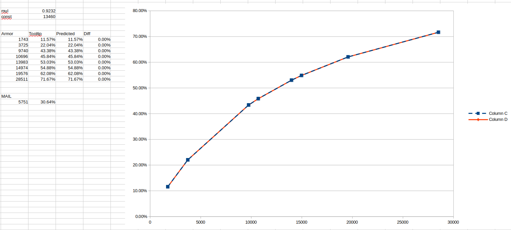

# Welcome to Ângry's Fellowship TC dump


## News
```
Massive updates to how mobs / spells are tracked. (5/25/26)
```

This Git is for sharing my TC data or dumps with the community. I will update as needed. 


## (WIP) - I'll be updating a lot.


It seems both Health and Dmg scaling follow the same rules.
```
ROUND(ROUND(28560*BaseHealthMutliplier)*DifficultyScaleMultiplier)
ROUND(ROUND(1700*Spell_CoEffecient)*DifficultyScaleMultiplier)
```

# Fellowship Formulas
### Stats
**Diminishing Returns**
Secondary attributes are affected by Diminishing Returns (DR). Beyond 10%, each rating point has less weight towards the stat percent.

- From 0-10% you get full value.
- From 10-15% you get 0.95 value.
- From 15-20% you get 0.9 value.
- From 20-25% you get 0.85 value.
- Beyond 25% you get 0.8 value

*The default mod starts at .017 but each step the new value gets reduced by the next tier*

### Mechanic Math
**Value of Crit damage and Crit Mods**
```
(base_dmg * non_crit_chance)  + (base_dmg * crit_chance * crit_dmg_mod)
```
To factor this with elarion purple 30% crit and last light 30% just add `crit_pct + .3 * .8`
**Crit Damage Mods**
```
2 * (1 + mod + mod + mod)
```
**Spirit Proc Chance**
```
%spirit/1.%spirit
```
**Spirit Gain and Spirt**
So mobs have spirit. Take void lord 400. This is split between the group over time doing damage.
```
20 * 1.spirit
```
**Gem Overcap Mods**
```
0.01
12 * 0.01 / 100 + 1
1.0012
```
This is applied to the stam directly then the stamina to health mod is used on it.

**Magic DR**
```
(1 - .1) * (1 - .072)
1 - result = total dr
```
**Armor DR**
```
armor / (0.9232 * armor + 13460)
```

**Damage and ability mods**
```
random(0.9, 1.1)
```
The ability mod will be the avg of the low/high values averaged
**Red/Diamond flat + main_stat**
Apparently this is just added to base before the other math.

*It seems that abilities all have a mod and this is then either plus or minus 10% either direction.*

**Focus Regen**
```
5/s
5 * 1.haste%
```