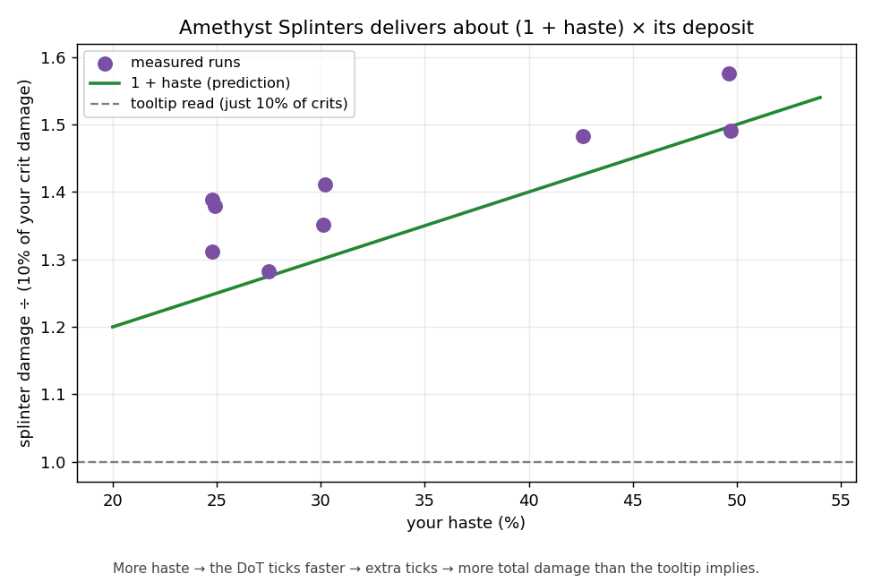
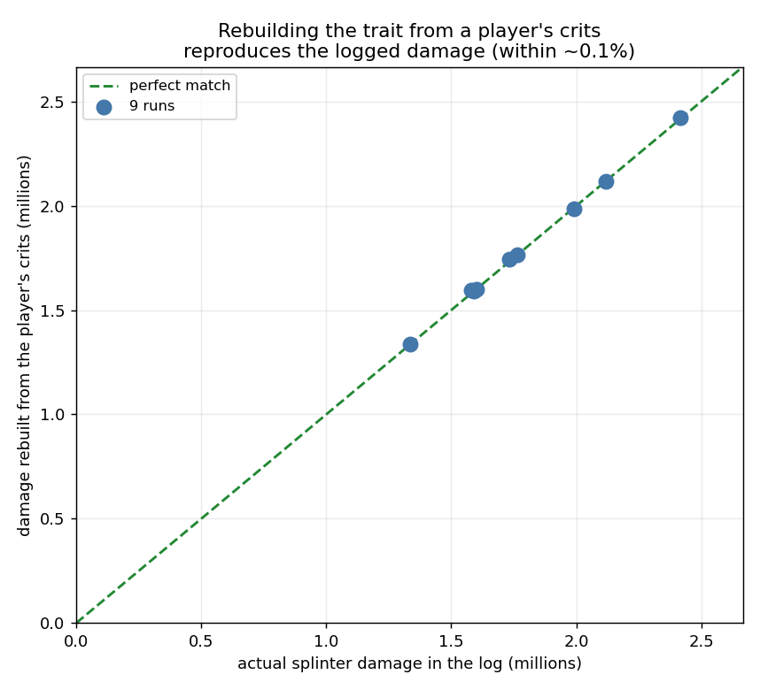

*Season 2. The mechanic's shape is stable; the exact percentages and tick timing are a current-patch snapshot.*

# Amethyst Splinters — Why It Out-Damages Its Tooltip

Amethyst Splinters pays out about 1.3 to 1.5 times what its tooltip implies, and the gap is almost all haste. Read literally, the trait looks like a modest extra slice of each crit. In the logs it delivers a good deal more, for two reasons the tooltip never spells out: the effect accumulates instead of overwriting itself, and it ticks hasted, so more ticks land than the four it's built for. The result is a trait that scales with your crit damage and your haste at once.

## What the tooltip says

On a critical strike, the trait deals an extra 7/8/9/10% (by rank) of that hit's damage as a damage-over-time effect over 8 seconds, one tick every 2 seconds at its base rate. The over-time portion can't crit, and it doesn't scale with gem power. Read that straight and you'd expect "10% of each crit, spread over 8 seconds." That under-counts the real damage by a third or more.

## It accumulates, so nothing clips

A normal damage-over-time effect throws away whatever it hasn't dealt yet the moment you re-apply it. Splinters does the opposite. When a fresh crit lands while the effect is still ticking, it carries the leftover un-dealt damage forward, adds the new deposit on top, and re-spreads the combined pool over a fresh 8 seconds. A stream of crits compounds into one growing rolling effect instead of a row of half-wasted ones. That's why the trait rewards sustained crit pressure rather than one-off hits.

## It's hasted, and that's the bigger factor

This is the part that explains the missing damage. The per-tick size is set for the base cadence, four ticks across 8 seconds. But the effect is hasted, so it ticks faster (roughly every 1.5 seconds at 40% haste) and more than four ticks fire before the window closes. Each tick still delivers its base-sized amount, so the effect pays out about (1 + your haste) times what was deposited. At 40% haste that's a 1.4x multiplier on top of the deposit, for nothing.



*Each point is one run: total Splinter damage divided by the naive "10% of your crits" estimate, plotted against the player's haste. The points ride the (1 + haste) line — at 40% haste, about 1.4x. The flat line at 1.0 is the literal tooltip read.*

## How we know

The whole effect was rebuilt from nothing but each player's crits: take the trait's cut of every crit, roll it through the accumulation rule, and tick it out at the observed hasted cadence. The reconstruction matches the actual logged damage to within about 0.1%, tick for tick, on every run tested. So the numbers here aren't a curve fit. They're a from-scratch rebuild that lands on the real value.



*Splinter damage rebuilt from a player's crits vs. the actual logged damage, one point per run. Every point sits on the perfect-match line.*

## How it scales

Delivered damage works out to roughly:

```
splinter_total ~= (1 + haste) * 0.10 * (total crit damage dealt)
```

Two things feed it. Crit sets the deposit — the 10% skimmed off each crit, so more crits or bigger crits make a bigger pool. Haste sets the delivery — the (1 + haste) multiplier from the extra hasted ticks. Both grow the trait's output.

Which stat to gear for is a separate question, and the splinter math alone doesn't answer it — that depends on your whole rotation, not just this trait. So count crit and haste as both feeding Splinters, and let the rest of your build settle the balance.

## What it means for play

- It's worth more than the tooltip reads. The "X% of your crit" is only the deposit; haste decides how much actually gets delivered.
- It scales on two stats at once. Your biggest crits make the biggest deposits, and your haste sets how many times each deposit pays out.
- It rewards sustained crit pressure. Crits compound into a single rolling pool that never wastes its leftover, so steady output beats spiky bursts.
