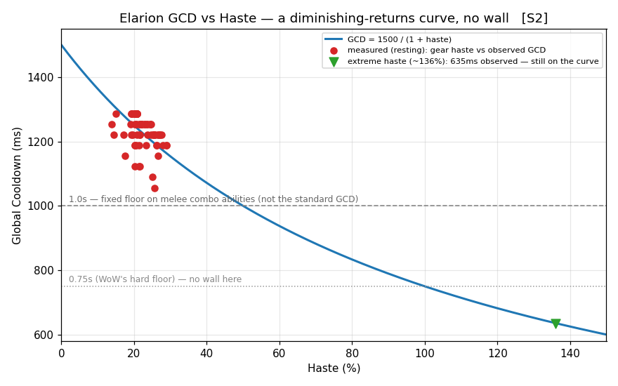
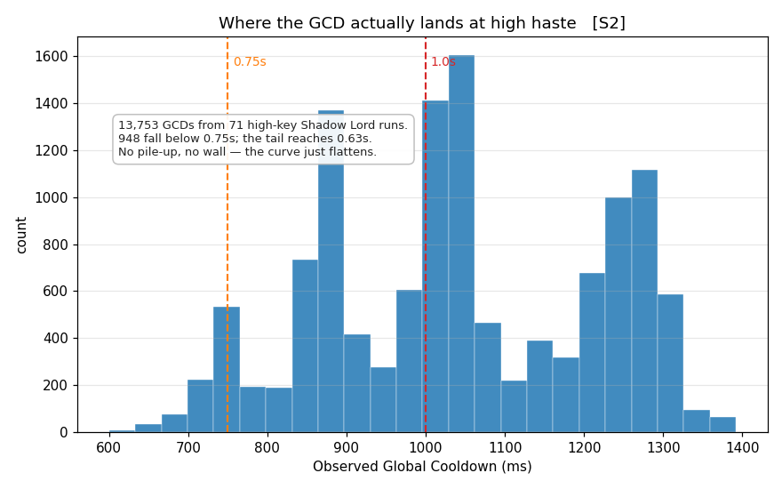

# Elarion's Global Cooldown: the formula, no wall, and what's off it

*Applies to S2.*

Your global cooldown is `1.5 / (1 + haste)`, in seconds. That's the whole formula. At 20% haste it's 1.25s; at 50% it's an even second; at 75% it's 0.86s. Haste shrinks it, and here's the part worth knowing: there's no wall. No haste level where it stops getting shorter. But it is a curve, so the returns taper — each point of haste shaves a little less off the global than the point before it.

## The formula

Haste is stored as a multiplier. 0% haste is 1.0, 25% haste is 1.25, and the game divides a flat 1.5-second base by it:

```
GCD = 1.5 / (1 + haste/100)      (seconds)
```

A few points you'll actually see:

```
 haste     GCD
   0%     1.50s
  15%     1.30s
  20%     1.25s
  25%     1.20s
  30%     1.15s
  40%     1.07s
  50%     1.00s
  75%     0.86s
 100%     0.75s
```

One thing to keep straight: this is the global cooldown, not your cast or channel times — those are separate clocks. Heartseeker Barrage, for instance, is a fixed-length channel. Haste doesn't shorten it; it packs more arrows into the same window.

## No wall — but it is a curve

The standard global cooldown has no minimum. The formula just keeps dividing, and the logs follow it down well past anything you'd see in a normal pull.

The game *can* floor a GCD when the designers want to. Certain melee combo-builders and spenders run on a fixed 1.0-second global that haste cannot shrink below 1.0s — a deliberate, separate rule for those abilities. Everything Elarion casts uses the standard global, which has no such clause.

To stress it, I measured globals across 71 high-key Shadow Lord runs, where haste stacks far past normal. The global slides straight through 1.0s — and through 0.75s, the kind of hard floor you'd find in other games. Nearly a thousand measured globals came in under 0.75s, and the tail reached about 0.63s at roughly 136% haste. No pile-up at any value, no wall.

What you do see is the curve flattening. Because the formula is `1 / (1 + haste)`, each point of haste buys less than the last. The first 25% of haste takes you from 1.50s to 1.20s — 300ms. The next 25%, up to 50%, only buys you down to 1.00s — 200ms. Past 100% haste you're shaving under a hundred milliseconds per 25%, not hundreds. So the typical fully-buffed global parks around 0.74s, and going lower takes a lot of stacking for a little gain. Haste keeps helping — just less, the higher you climb.





The red dots are resting globals measured straight off cast timing, plotted against gear haste — they sit on the formula curve. The green marker is the extreme-haste reading at ~136%, still on the curve at 0.63s. The histogram is every measured global from those 71 runs: it slides past 0.75s and thins out, with no stack of values piled at any one number.

## The 33-millisecond grain

The server runs 30 times a second, so every global resolves on a 33.33ms tick. Measured globals land on exact multiples of it — 1267, 1233, 1200, then 1067, 1033, 1000, and so on down. The practical version: your GCD changes in ~33ms steps, so a sliver of haste that doesn't push you across the next tick boundary won't change your cadence. You don't need to chase an exact haste number for the global itself. The curve is smooth at the scale that matters; the grain only shows up if you're counting milliseconds.

## What's off the global

Some abilities don't spend the global cooldown at all. Pressing one doesn't put your next cast on the global:

- Lunarlight Mark
- Disrupt (your interrupt)
- Roll
- Auto-attacks

Off-GCD means the global isn't the thing gating these — not that they're free in every situation. While you're mid-channel on Heartseeker Barrage you're committed to the channel, so weaving there still costs you. The narrow, reliable takeaway: outside a channel, pressing Mark or your interrupt doesn't put your next cast on the global cooldown.

## What to do with this

Haste tightens the global with no wall in front of it — but it's a curve, not a flat multiplier. There's no breakpoint where it dies, so it never becomes a dead stat. Early haste buys real global; once you're already fast, each extra point shaves less, so at the top end more haste tends to do more for your damage elsewhere than for the global itself. And outside a channel, Mark and your interrupt don't cost you a global — that's one less thing to budget around.
