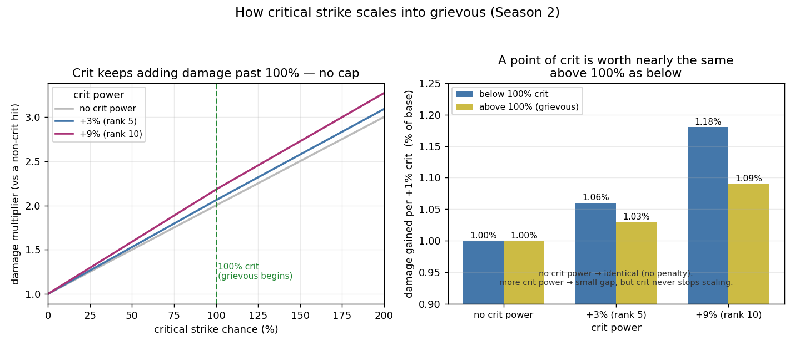

# Grievous Critical Strikes — Overflow Crit and Crit Power

> **As of Season 2 (2026-05-31).** The grievous *mechanic* (crit beyond 100% → overflow → bonus damage) is structural and unlikely to change shape. The specific *values* below — crit power percentages, gem-rank bonuses, effect amounts — reflect the live game at this date and are patch-dependent. Treat any specific number as a Season 2 snapshot, not a permanent constant.

## Summary
Critical strike chance above 100% is not wasted. The excess — the **overflow** — is converted into bonus damage through a **grievous critical strike**. This is the mechanic behind effects that grant "+100% critical strike chance," and it sets how crit power compounds with them. This report gives the exact formula and how each piece combines.

## A normal critical strike
A critical strike multiplies a hit. The base critical strike is a **2× (double)**. **Crit power** (from amethyst gems) increases that, *multiplicatively*:

> normal crit = base × **2 × (1 + crit_power)**

where crit power is **+3% at gem rank 5** and **+9% at gem rank 10** *(S2 values)*. A rank-10 crit therefore deals **×2.18**.

## Grievous: critical chance beyond 100%
Once critical strike chance reaches 100%, every hit crits. Any chance **beyond** 100% — the overflow — is added to the hit as extra base damage. That is a grievous critical strike. Multiple effects state the rule in identical wording:

> *"Any critical strike chance you have beyond 100% causes a grievous critical strike. Grievous critical strikes increase the base damage of the hit by an amount equal to the overflowing critical strike chance."*

## The formula

> **grievous = base × (2 + overflow / 100) × (1 + crit_power)**

- **base** — the hit's normal, non-crit damage.
- **overflow** — critical strike chance above 100%, in percent.
- **crit_power** — amethyst bonus: 0 / +3% (rank 5) / +9% (rank 10) *(S2 values)*.

Reading it: the **2** is the standard crit double; the **overflow** adds that fraction of base on top; **crit power multiplies the whole hit** — applied once, to the entire bracket, not doubled on its own.

## When does crit stop gaining value?
Crit chance has exactly **one** breakpoint — **100%** — and it never stops adding damage past it.

- **Below 100%:** a crit is a `2 × (1 + crit_power)` hit, so each **+1% crit** adds `(1 + 2·crit_power)%` of base damage on average (it turns 1% of hits into that bigger crit).
- **At and above 100%:** every hit already crits, so each **+1% crit** instead adds a guaranteed slice of overflow — `(1 + crit_power)%` of base damage per point.

So at 100% the *value of one more point of crit* takes a single **step down**, by a factor of `(1 + crit_power) / (1 + 2·crit_power)`, and then stays **flat forever**. There is no cap and no decay: every point past 100% keeps adding the same guaranteed damage.

The size of that step depends entirely on crit power:

| crit power | value below 100% | value above 100% | step down |
|---|---|---|---|
| none | +1.00% per +1% | +1.00% per +1% | **none** |
| +3% (rank 5) | +1.06% per +1% | +1.03% per +1% | ~3% |
| +9% (rank 10) | +1.18% per +1% | +1.09% per +1% | ~8% |

With **no crit power there is no step at all** — crit is worth exactly the same on both sides of 100%. The step only exists because crit power rewards a full crit more than it rewards overflow, and it grows as crit power grows.

*Left: total damage multiplier vs critical strike chance — it keeps climbing past 100% with no cap; crit power lifts the whole line. Right: the damage one more +1% of crit adds, below vs above 100%. With no crit power the two are identical — there is no penalty for going past 100%. Crit power opens a small gap (a point is worth a little less as overflow than as a fresh crit), but crit keeps adding value at every level.*

*(This is about crit **chance**. Crit **rating** from gear converts into crit chance through diminishing returns — a separate effect that applies at every level, not just at 100%.)*

## Effects that force a grievous
Some effects grant **+100% critical strike chance**, which brings total crit to a guaranteed 100% with the rest of your critical strike chance sitting on top as overflow. A void-touched weapon effect detonates this way (always grievous), and some talents proc it on a specific ability.

On these hits the overflow is whatever critical strike chance is in play **above** the 100% the effect supplied. A clean measurement on a target with no other crit modifiers shows that overflow equal to the character's sheet critical strike chance. How much *conditional* critical strike chance (sources that only apply against certain targets) adds to that overflow is **not yet established** and is deliberately left open here rather than assumed.

## Worked example
A hit with base **30,000**, sheet crit **20%**, rank-10 crit power (+9%):

| outcome | calculation | result |
|---|---|---|
| normal hit | 30,000 | 30,000 |
| normal crit | 30,000 × 2 × 1.09 | 65,400 |
| grievous (via a +100% effect) | 30,000 × (2 + 0.20) × 1.09 | **71,940** |

The grievous adds the 20% overflow (6,000 of base) on top of the double, then crit power scales the whole hit.

## Basis
- The formula's **structure** is stated directly in several in-game effect descriptions.
- On a **training dummy with no crit power**, grievous hits measured at exactly **base × (2 + sheet_crit / 100)** against the effect's published damage range.
- Crit power is **multiplicative, not additive** — confirmed by comparing critical to non-critical damage across crit-power tiers over many hits: the no-crit-power tier lands at ×2.00 and the top tier lands at twice the crit-power factor, matching `2 × (1 + crit_power)` and not a flat addition.

## What it means for play
- **Crit chance over 100% is never wasted** — it becomes grievous bonus damage, scaling with how far past 100% you are.
- **Crit power scales crits and grievous hits multiplicatively**, so it compounds with overflow rather than adding a flat amount.
- **The value of crit bends at 100%**, not falls off — it stays useful past the threshold, just at the overflow rate. Effects that grant +100% crit make your remaining critical strike chance overflow on hits that were already guaranteed to crit.
