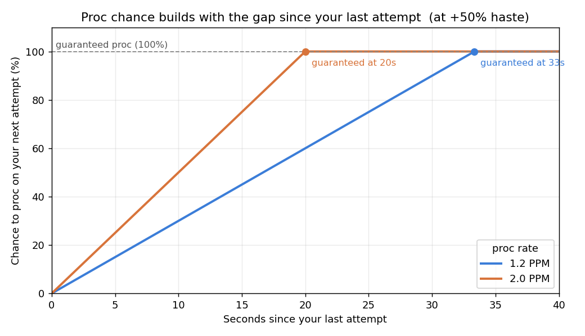

*Season 2. The mechanic has held all season; the per-proc rates below are the S2 numbers.*

# How Procs Work — Time and Haste, Not Just a Flat Roll

Many procs in Fellowship don't roll a flat percentage. For those, your chance to proc scales with two things at once: how long it's been since your last attempt, and your haste. It's capped at 100%, and there's bad-luck protection underneath so you never go cold forever. That has real consequences for play. More haste literally means more procs, and stepping out of combat for a moment hands you a near-guaranteed one on the way back in. Not every proc works this way — some are just a flat chance — so this report covers the ones that aren't, the handful that were measured here.

## The rule

The procs covered here run on a per-minute rate, a PPM. Not every proc does — some are just a flat chance per attempt, with no rate behind them — but for a PPM proc, the roll on any single attempt isn't just PPM over 60. It's stretched by the time since your last attempt and your haste:

```
chance = PPM / 60 * seconds_since_last_attempt * (1 + haste)      (capped at 100%)
```

Runnable in a sheet:

```
=MIN(1, PPM/60 * gap_seconds * (1 + haste))
```

Haste goes in as a fraction, so +40% is 0.40. An attempt is each time the thing that can trigger the proc fires, which for most of these is a cast. The longer the gap between your attempts, and the more haste you carry, the higher each roll climbs.



*Chance to proc on your next attempt, plotted against how long since the last one, at +50% haste. A faster proc (higher PPM) climbs steeper and hits the guaranteed line sooner. Past that point, the next attempt always procs.*

## More haste, more procs

Average it over a fight and a hasted proc fires about:

```
procs_per_minute = PPM * (1 + haste)
```

At +50% haste a 2.0-PPM proc lands roughly 3 times a minute, not 2. Haste isn't only faster casts. It directly multiplies how often these procs go off, which is easy to forget when you're weighing stats.

## Leave combat, get a proc

Because the roll grows with the gap since your last attempt, a long pause loads the dice. Wait long enough and the next attempt is a guaranteed proc. The break-even point:

```
seconds_to_guarantee = 60 / (PPM * (1 + haste))
```

For a 2.0-PPM proc at +50% haste that's 20 seconds. For a 1.2-PPM proc it's about 33. Step off the target for that long, come back, and your first hit procs every time. It works as an opener: let a gap build before a pull and you start the fight with the proc already up.

## You won't stay dry

True random has no memory, so a brutal drought is always on the table. This isn't that. The procs carry bad-luck protection, and your dry streaks are capped relative to your normal rate. The worst droughts measured ran about 3.5 to 5 times the average gap between procs, and 95% of them stayed under roughly 3 times. Pure random at the same sample sizes would have stretched well past 8 times the average. The floor under your luck is real, and you'll never sit through the dead streak an unprotected roll can deal.

## Not every proc works the same way

Most of these trigger on a cast, and for those, haste scales the rate exactly as the rule says. Two things break that pattern, and both are worth knowing before you gear around them.

Some procs are flat. Set bonuses, mostly. Dark Prophecy fires at its listed rate whether you're at 0% or 60% haste, so stacking haste won't squeeze more out of it.

And not everything triggers on a cast. Draconic, a set, fires off your crits. Diamond Strike, a weapon trait, fires off your hits landing damage. What feeds those is how often you crit or how much you're connecting, not the cast clock. Whether haste also scales their rate, the way it clearly does for the cast procs, isn't pinned down, so don't count on it.

Measured rates (S2) and what each one triggers on:

| Proc | Rate (per minute) | Triggers on | Haste scales the rate? |
|---|---|---|---|
| Dark Prophecy (set) | 0.8 | a cast | no, flat |
| Inspired Allegiance (weapon trait) | 1.2 | a cast | yes |
| Celestial Impetus | 2.0 | a cast | yes |
| Vengeful Soul (weapon trait) | 2.0 | a cast | yes |
| Hidden Power (weapon trait) | 2.6 | a cast | yes |
| Draconic (set) | 1.0 | a crit | not pinned down |
| Diamond Strike (weapon trait) | 6.7 | dealing damage | not pinned down |

The cast procs all land on the same rule: rate equals PPM times (1 + haste), with Dark Prophecy the flat exception. The crit and damage ones fire off a different trigger, so crit rate and how much you're hitting drive them instead.

## What it means for play

- Haste buys procs. On top of faster casts, every point of haste raises how often your hasted procs fire, since rate is PPM times (1 + haste).
- Use combat gaps. A pause of 60 / (PPM * (1 + haste)) seconds guarantees the next attempt procs. Time one before a pull and open with the proc already running.
- Don't fear droughts. Bad-luck protection caps how long you go without a proc, so there are no infinite cold streaks to play around.
- Flat procs don't care about haste. Dark Prophecy and other flat set procs fire at a fixed rate. Don't gear haste expecting more from them.
