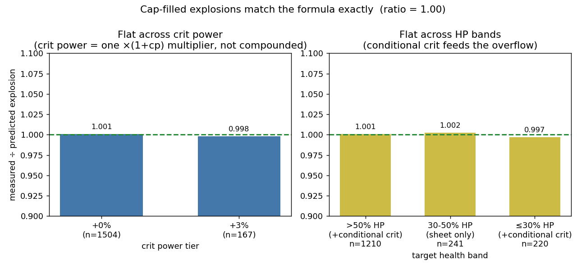
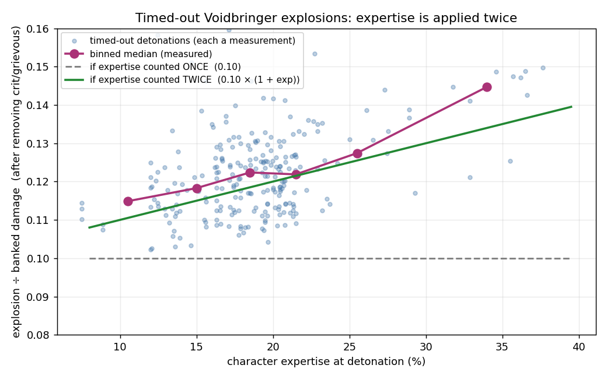

# Voidbringer's Touch — the banked grievous explosion

> **As of Season 2 (2026-06-01).** The mechanic's *structure* (bank a share of your damage, detonate as a guaranteed grievous) is stable. The specific *numbers* — the cap multiplier, the bank rate, crit-power values — are a Season 2 snapshot and are patch-dependent.

This pairs with the grievous critical strikes report; read that first for the grievous formula itself.

## What it does
Voidbringer's Touch is a weapon effect that places a debuff on the target. While that debuff is up it **banks a share of the damage you deal**, then **detonates** that banked damage as a single hit. The detonation is **always a grievous critical strike** — the effect supplies +100% critical strike chance, so the hit is guaranteed to crit and to overflow (see the grievous report for what that means).

Three numbers define it:
- **Bank rate — 10%.** Every point of damage you deal while the debuff is up adds 10% of itself to the bank.
- **Cap — `primary × 42.5`.** The bank cannot store more than 42.5× your primary stat.
- **Window — 15 seconds**, on a 90-second cooldown.

## How it detonates
The explosion fires on whichever comes first: the bank **fills the cap**, the **15-second window ends**, or the stored amount is enough to **kill the target**. The damage is:

> **explosion = (banked damage, up to the cap) × grievous × expertise × situational damage modifiers**

"grievous" is the same `(2 + overflow/100) × (1 + crit_power)` from the grievous report. Because the effect forces +100% crit, the overflow equals all the critical strike chance you actually have — **including conditional crit** (sources that only apply against certain targets, e.g. above 50% health or below 30%). Conditional crit feeding the overflow is visible in the data below.

*Explosions that filled the cap, compared to the formula's prediction. The ratio sits at 1.00 and is flat across crit-power tiers (left — crit power enters as a single `×(1+crit_power)`, not compounded) and flat across target-health bands (right — the >50% and ≤30% bands carry extra conditional crit, yet still match, which only happens if that conditional crit is feeding the overflow).*

## The expertise twist
Expertise (a stat that increases damage) interacts with the explosion in a way that depends on **how** it detonated.

- **If the explosion fills the cap**, expertise is applied **once**. The cap (`primary × 42.5`) is an expertise-free number; the explosion adds expertise on top, a single time.
- **If the explosion times out without filling the cap**, expertise is effectively applied **twice**. The banked damage is 10% of the damage you *dealt* — and that damage already included your expertise. When the explosion then applies expertise again, it lands a second time.

In other words, a timed-out explosion is **10% × (1 + expertise)** of your banked damage, not a flat 10%. The measurement below shows it directly: across hundreds of timed-out explosions, the ratio rises with expertise exactly along the "counted twice" line and clearly rejects a flat "counted once" rate.

*Each point is one timed-out explosion: its damage divided by its banked damage, after removing crit and grievous. If expertise applied once, every point would sit on the flat grey line at 0.10. Instead the measured trend (pink) rises with expertise along the green `0.10 × (1 + expertise)` line — expertise is counted twice. The same doubling appears whether the expertise comes from gear or from a temporary in-run source, so it is the explosion mechanic, not any one stat source.*

## Why the two tooltips disagree (they don't)
The weapon's two descriptions give different cap numbers, and both are right — they describe different points in the process:
- The **debuff** description states the cap as **"4250% of primary"** — that is the expertise-free cap, `primary × 42.5`.
- The **weapon** description shows a larger number — that is the same cap **after** the explosion's expertise is applied, `primary × 42.5 × (1 + expertise)`.

One is the stored limit; the other is what that limit looks like after it detonates. On a geared character with ~21% expertise the two differ by exactly that 21%.

## What it means for play
- **The explosion scales with everything you do during the window** — it banks 10% of your real, already-buffed damage, so a strong burst window directly feeds a bigger explosion.
- **Expertise is unusually strong for this effect when it times out**, because it lands twice on those explosions. When the explosion caps out instead, expertise behaves normally (once).
- **All of your critical strike chance feeds the explosion**, including conditional crit that only applies against certain targets — the explosion is a guaranteed grievous, so none of that crit is wasted.
- **Crit power scales it multiplicatively**, the same as any grievous hit (see the grievous report).
